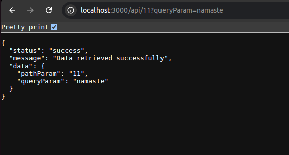
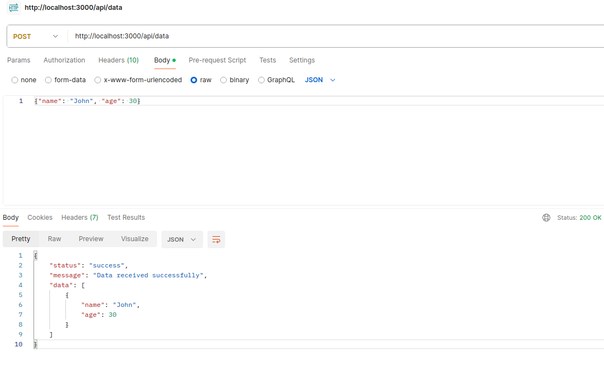

# ExpressJS_Test

STEP 1: Create an express server
npm init -y
npm install express

STEP 2: Create a GET api that returns query param, path param and return both values with info as json
app.get('/api/:pathParam', (req, res) => {
const pathParam = req.params.pathParam;
const queryParam = req.query.queryParam;

    // Return both values as JSON
    res.json({
        status: 'success',
        message: 'Data retrieved successfully',
        data: {
            pathParam: pathParam,
            queryParam: queryParam
        }
    });

});

STEP 3: Create a POST api which acccepts a JSON data. Return an array of data.
// POST API
app.post("/api/data", (req, res) => {
const jsonData = req.body;
// Return the data as an array
res.json({
status: "success",
message: "Data received successfully",
data: [jsonData],
});
});

app.listen(PORT, () => {
console.log(`Server is running on http://localhost:${PORT}`);
});

// Start the server
node server.js
